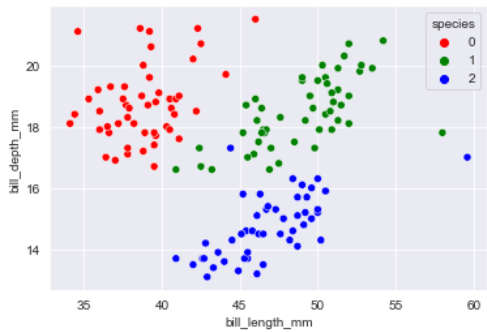
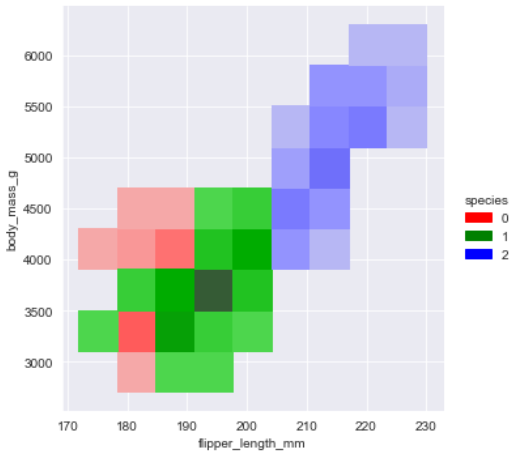
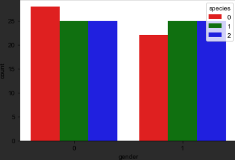
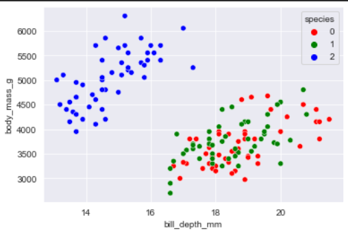
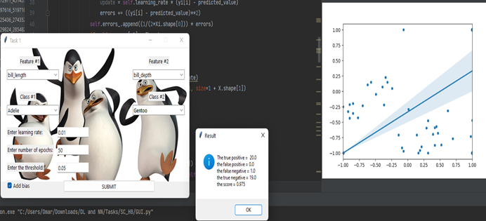

# Adaline Neural Network Implementation with GUI

This repository contains an implementation of the Adaline neural network algorithm with a graphical user interface (GUI) for easy visualization and hyperparameter tuning.
This task is designed for DeepLearning & NeuralNetwork course by FCIS~ASU
You can check the documentation file attached for full guide : 

## Features

- Adaline neural network implementation
- Graphical user interface (GUI) for easy visualization and hyperparameter tuning
- Feature comparison tool

## Visualizations

Below are some statistics visualizations of the performance of the Adaline neural network on various datasets:

- 

- 

## GUI
- 

## Usage

To use the Adaline neural network implementation and the GUI, follow these steps:

1. Clone this repository
2. Run `python GUI.py` to launch the GUI

## Acknowledgements

The implementation of the Adaline neural network algorithm is based on the work of Bernard Widrow and Ted Hoff, and the GUI is built using the tkinter library.

## References

- [Widrow, B. and Hoff, M. E. (1960). "Adaptive Switching Circuits". IRE WESCON Convention Record, Part 4, pp. 96–104.](https://ieeexplore.ieee.org/abstract/document/1442003)
- [Tkinter documentation](https://docs.python.org/3/library/tkinter.html)
